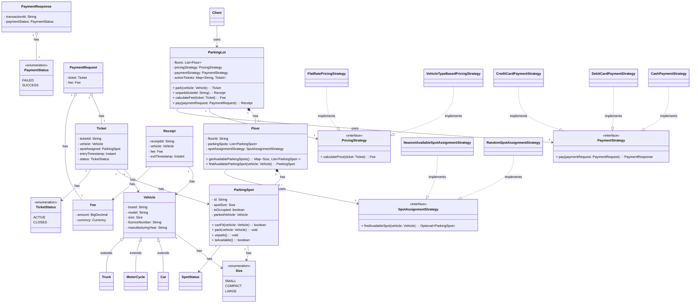

# Designing a Parking Lot System

## Problem Statement

Design a **Parking Lot Management System** for a multi-level parking facility. The system should support vehicles of different types, track available spots in real time, handle entry/exit flow, compute parking fees, and be extensible for future features (e.g., reservations, EV charging, multiple payment modes).

You are expected to:
1. Identify the core entities and their relationships.
2. Define class diagrams (or code) using appropriate OOP principles and design patterns.
3. Write clean, extensible, working code (in any language of your choice) for the core flows.

---

## Functional Requirements

1. **Multi-level parking lot**
    - The parking lot has multiple floors/levels.
    - Each level has multiple parking spots.

2. **Multiple spot types**
    - Spots are categorized by size: `MOTORCYCLE`, `COMPACT`, `LARGE` (and optionally `HANDICAPPED`, `ELECTRIC`).
    - A vehicle can only park in a spot that fits its size (a motorcycle spot cannot hold a truck; a large vehicle cannot park in a compact spot).

3. **Multiple vehicle types**
    - Supported vehicle types: `MOTORCYCLE`, `CAR`, `BUS`/`TRUCK` (extensible).
    - Each vehicle type maps to a minimum spot size requirement.

4. **Entry/Ticketing**
    - When a vehicle enters, the system finds an available, suitable spot and assigns it.
    - A parking ticket is generated capturing: ticket ID, vehicle number, spot assigned, entry timestamp.
    - If no suitable spot is available, the system should reject entry with a clear message ("Parking Full" for that vehicle type).

5. **Exit & Fee Calculation**
    - When a vehicle exits, the ticket is scanned/looked up, exit timestamp is recorded.
    - Parking fee is calculated based on duration and vehicle type, using a configurable pricing strategy (e.g., flat rate for first hour, hourly rate after; or per-vehicle-type rates).
    - The spot is released and becomes available for new vehicles.

6. **Real-time availability**
    - The system should be able to report the number of free spots per level and per spot type at any time.

7. **Payment**
    - Support at least one payment method (e.g., cash, card); design so new payment methods can be added easily.

8. **Display boards**
    - Each level should show real-time count of free spots by category (nice-to-have, tests Observer pattern understanding).

---

## Non-Functional / Design Expectations

- **Extensibility**: Adding a new vehicle type, spot type, or pricing strategy should require minimal changes to existing code (Open/Closed Principle).
- **Concurrency**: Multiple vehicles may try to enter/exit simultaneously — spot assignment must be thread-safe (discuss locking strategy even if not fully implemented).
- **Separation of concerns**: Ticketing, spot management, pricing, and payment should be decoupled.
- **Testability**: Core logic (spot allocation, fee calculation) should be unit-testable without needing a UI or database.

## Clarifying Questions You Should Ask (and be ready to answer as interviewer)

- Can a vehicle occupy a spot larger than needed if the exact fit isn't available? (e.g., car in a large spot)
- Is pricing flat, tiered by hour, or based on vehicle type × duration?
- Should the system support reservations in advance?
- Is there a maximum parking duration or overnight policy?
- Should lost-ticket scenarios be handled (e.g., charged max rate)?

---

## Deliverables

1. **Class diagram** (or equivalent class definitions) covering the entities above.
2. **Core code** for:
    - Parking a vehicle (`parkVehicle(vehicle) -> Ticket`)
    - Unparking a vehicle (`unparkVehicle(ticket) -> Receipt`)
    - Checking availability (`getAvailableSpots(level, spotType)`)
3. **Explanation of design pattern choices** and how the design supports extensibility (e.g., adding a new vehicle type or a discount pricing rule without modifying core logic).

---

## Evaluation Criteria

- Correctness and completeness of OOP modeling (right abstractions, no god classes).
- Appropriate and justified use of design patterns (not forced).
- Handling of edge cases (lot full, invalid ticket, concurrent entry).
- Code quality: readability, SOLID principles, extensibility.
- Ability to reason about trade-offs (e.g., locking strategy for spot allocation under concurrency).

