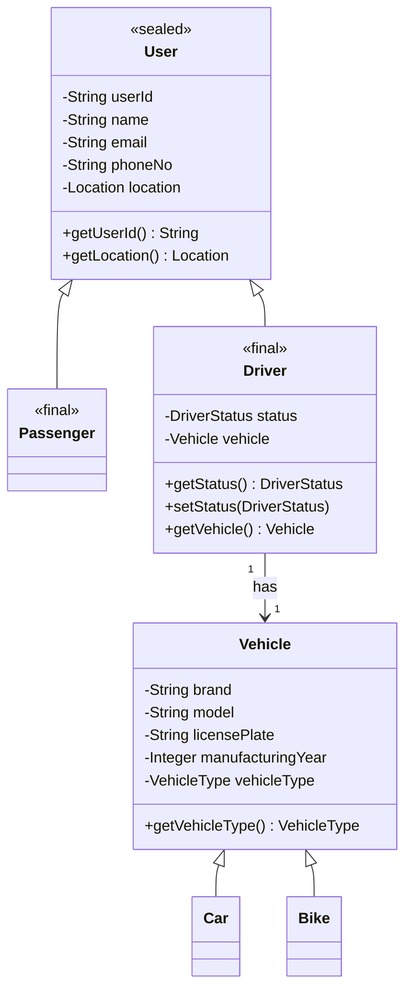
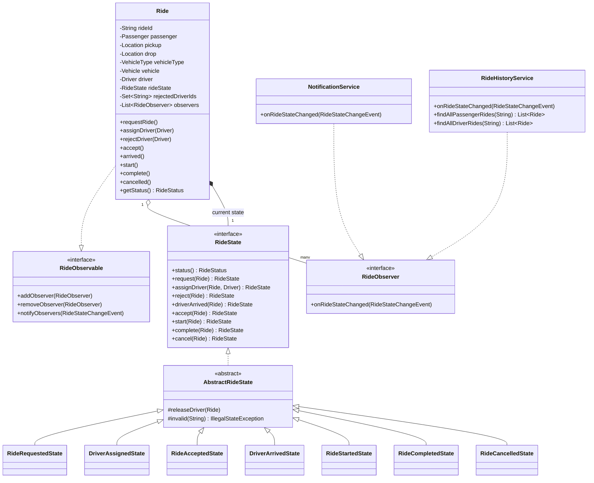
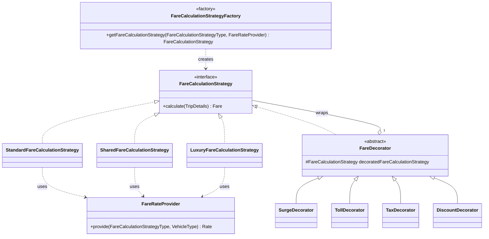
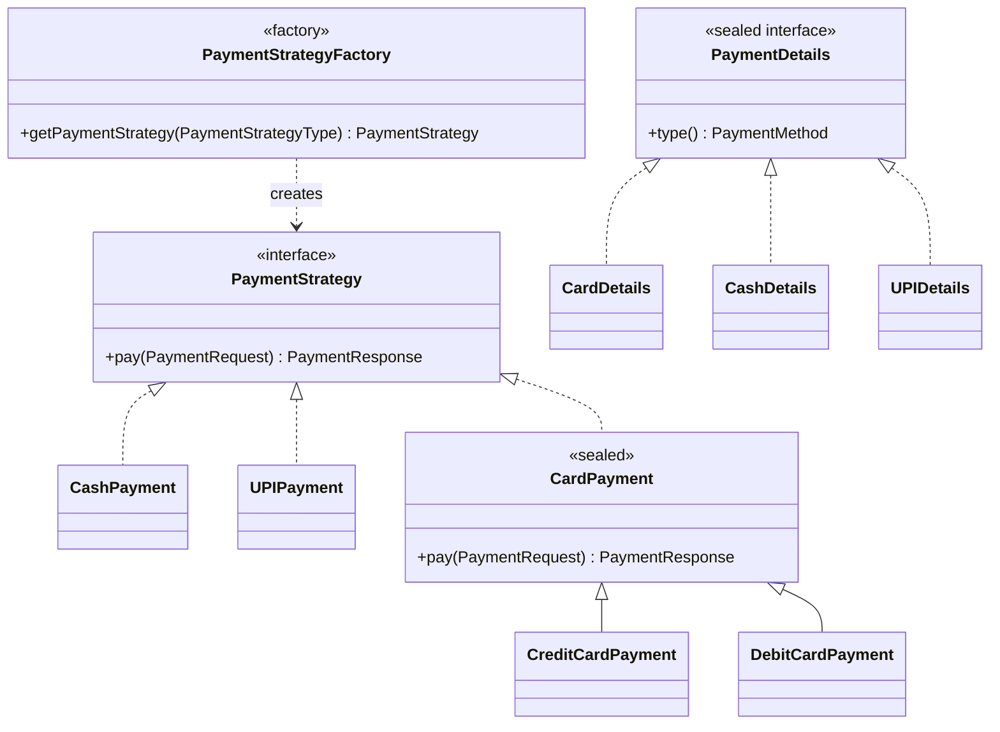
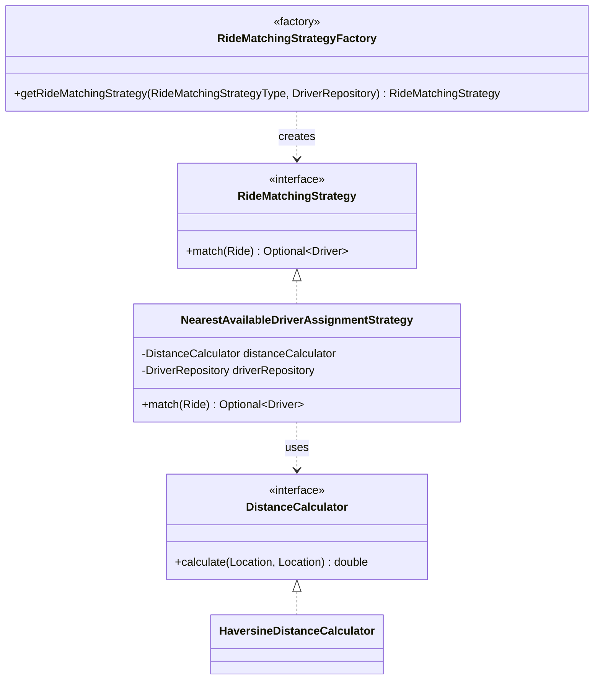
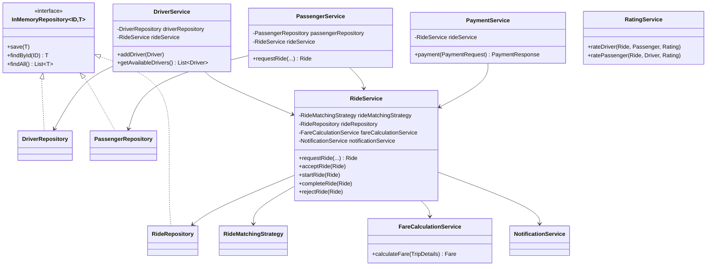

```mermaid
classDiagram
    class User {
        <<sealed>>
        -String userId
        -String name
        -String email
        -String phoneNo
        -Location location
        +getUserId() String
        +getLocation() Location
    }
    class Passenger {
        <<final>>
    }
    class Driver {
        <<final>>
        -DriverStatus status
        -Vehicle vehicle
        +getStatus() DriverStatus
        +setStatus(DriverStatus)
        +getVehicle() Vehicle
    }
    class Vehicle {
        -String brand
        -String model
        -String licensePlate
        -Integer manufacturingYear
        -VehicleType vehicleType
        +getVehicleType() VehicleType
    }
    class Car
    class Bike

    User <|-- Passenger
    User <|-- Driver
    Vehicle <|-- Car
    Vehicle <|-- Bike
    Driver "1" --> "1" Vehicle : has
```

```mermaid
classDiagram
    class Ride {
        -String rideId
        -Passenger passenger
        -Location pickup
        -Location drop
        -VehicleType vehicleType
        -Vehicle vehicle
        -Driver driver
        -RideState rideState
        -Set~String~ rejectedDriverIds
        -List~RideObserver~ observers
        +requestRide()
        +assignDriver(Driver)
        +rejectDriver(Driver)
        +accept()
        +arrived()
        +start()
        +complete()
        +cancelled()
        +getStatus() RideStatus
    }

    class RideObservable {
        <<interface>>
        +addObserver(RideObserver)
        +removeObserver(RideObserver)
        +notifyObservers(RideStateChangeEvent)
    }
    class RideObserver {
        <<interface>>
        +onRideStateChanged(RideStateChangeEvent)
    }
    class NotificationService {
        +onRideStateChanged(RideStateChangeEvent)
    }
    class RideHistoryService {
        +onRideStateChanged(RideStateChangeEvent)
        +findAllPassengerRides(String) List~Ride~
        +findAllDriverRides(String) List~Ride~
    }

    class RideState {
        <<interface>>
        +status() RideStatus
        +request(Ride) RideState
        +assignDriver(Ride, Driver) RideState
        +reject(Ride) RideState
        +driverArrived(Ride) RideState
        +accept(Ride) RideState
        +start(Ride) RideState
        +complete(Ride) RideState
        +cancel(Ride) RideState
    }
    class AbstractRideState {
        <<abstract>>
        #releaseDriver(Ride)
        #invalid(String) IllegalStateException
    }
    class RideRequestedState
    class DriverAssignedState
    class RideAcceptedState
    class DriverArrivedState
    class RideStartedState
    class RideCompletedState
    class RideCancelledState

    Ride ..|> RideObservable
    Ride "1" o-- "many" RideObserver : notifies
    NotificationService ..|> RideObserver
    RideHistoryService ..|> RideObserver

    RideState <|.. AbstractRideState
    AbstractRideState <|-- RideRequestedState
    AbstractRideState <|-- DriverAssignedState
    AbstractRideState <|-- RideAcceptedState
    AbstractRideState <|-- DriverArrivedState
    AbstractRideState <|-- RideStartedState
    AbstractRideState <|-- RideCompletedState
    AbstractRideState <|-- RideCancelledState

    Ride "1" *-- "1" RideState : current state
```

```mermaid
classDiagram
    class FareCalculationStrategy {
        <<interface>>
        +calculate(TripDetails) Fare
    }
    class StandardFareCalculationStrategy
    class SharedFareCalculationStrategy
    class LuxuryFareCalculationStrategy

    class FareDecorator {
        <<abstract>>
        #FareCalculationStrategy decoratedFareCalculationStrategy
    }
    class SurgeDecorator
    class TollDecorator
    class TaxDecorator
    class DiscountDecorator

    class FareCalculationStrategyFactory {
        <<factory>>
        +getFareCalculationStrategy(FareCalculationStrategyType, FareRateProvider) FareCalculationStrategy
    }
    class FareRateProvider {
        +provide(FareCalculationStrategyType, VehicleType) Rate
    }

    FareCalculationStrategy <|.. StandardFareCalculationStrategy
    FareCalculationStrategy <|.. SharedFareCalculationStrategy
    FareCalculationStrategy <|.. LuxuryFareCalculationStrategy
    FareCalculationStrategy <|.. FareDecorator
    FareDecorator <|-- SurgeDecorator
    FareDecorator <|-- TollDecorator
    FareDecorator <|-- TaxDecorator
    FareDecorator <|-- DiscountDecorator
    FareDecorator "1" o-- "1" FareCalculationStrategy : wraps

    FareCalculationStrategyFactory ..> FareCalculationStrategy : creates
    StandardFareCalculationStrategy ..> FareRateProvider : uses
    SharedFareCalculationStrategy ..> FareRateProvider : uses
    LuxuryFareCalculationStrategy ..> FareRateProvider : uses
```

```mermaid
classDiagram
    class PaymentStrategy {
        <<interface>>
        +pay(PaymentRequest) PaymentResponse
    }
    class CashPayment
    class UPIPayment
    class CardPayment {
        <<sealed>>
        +pay(PaymentRequest) PaymentResponse
    }
    class CreditCardPayment
    class DebitCardPayment

    class PaymentStrategyFactory {
        <<factory>>
        +getPaymentStrategy(PaymentStrategyType) PaymentStrategy
    }

    class PaymentDetails {
        <<sealed interface>>
        +type() PaymentMethod
    }
    class CardDetails
    class CashDetails
    class UPIDetails

    PaymentStrategy <|.. CashPayment
    PaymentStrategy <|.. UPIPayment
    PaymentStrategy <|.. CardPayment
    CardPayment <|-- CreditCardPayment
    CardPayment <|-- DebitCardPayment

    PaymentStrategyFactory ..> PaymentStrategy : creates

    PaymentDetails <|.. CardDetails
    PaymentDetails <|.. CashDetails
    PaymentDetails <|.. UPIDetails
```

```mermaid
classDiagram
    class RideMatchingStrategy {
        <<interface>>
        +match(Ride) Optional~Driver~
    }
    class NearestAvailableDriverAssignmentStrategy {
        -DistanceCalculator distanceCalculator
        -DriverRepository driverRepository
        +match(Ride) Optional~Driver~
    }
    class DistanceCalculator {
        <<interface>>
        +calculate(Location, Location) double
    }
    class HaversineDistanceCalculator

    class RideMatchingStrategyFactory {
        <<factory>>
        +getRideMatchingStrategy(RideMatchingStrategyType, DriverRepository) RideMatchingStrategy
    }

    RideMatchingStrategy <|.. NearestAvailableDriverAssignmentStrategy
    DistanceCalculator <|.. HaversineDistanceCalculator
    NearestAvailableDriverAssignmentStrategy ..> DistanceCalculator : uses
    RideMatchingStrategyFactory ..> RideMatchingStrategy : creates
```

```mermaid
classDiagram
    class InMemoryRepository~ID,T~ {
        <<interface>>
        +save(T)
        +findById(ID) T
        +findAll() List~T~
    }
    class DriverRepository
    class PassengerRepository
    class RideRepository

    InMemoryRepository <|.. DriverRepository
    InMemoryRepository <|.. PassengerRepository
    InMemoryRepository <|.. RideRepository

    class RideService {
        -RideMatchingStrategy rideMatchingStrategy
        -RideRepository rideRepository
        -FareCalculationService fareCalculationService
        -NotificationService notificationService
        +requestRide(...) Ride
        +acceptRide(Ride)
        +startRide(Ride)
        +completeRide(Ride)
        +rejectRide(Ride)
    }
    class DriverService {
        -DriverRepository driverRepository
        -RideService rideService
        +addDriver(Driver)
        +getAvailableDrivers() List~Driver~
    }
    class PassengerService {
        -PassengerRepository passengerRepository
        -RideService rideService
        +requestRide(...) Ride
    }
    class FareCalculationService {
        +calculateFare(TripDetails) Fare
    }
    class PaymentService {
        -RideService rideService
        +payment(PaymentRequest) PaymentResponse
    }
    class RatingService {
        +rateDriver(Ride, Passenger, Rating)
        +ratePassenger(Ride, Driver, Rating)
    }

    RideService --> RideRepository
    RideService --> RideMatchingStrategy
    RideService --> FareCalculationService
    RideService --> NotificationService
    DriverService --> DriverRepository
    DriverService --> RideService
    PassengerService --> PassengerRepository
    PassengerService --> RideService
    PaymentService --> RideService
```