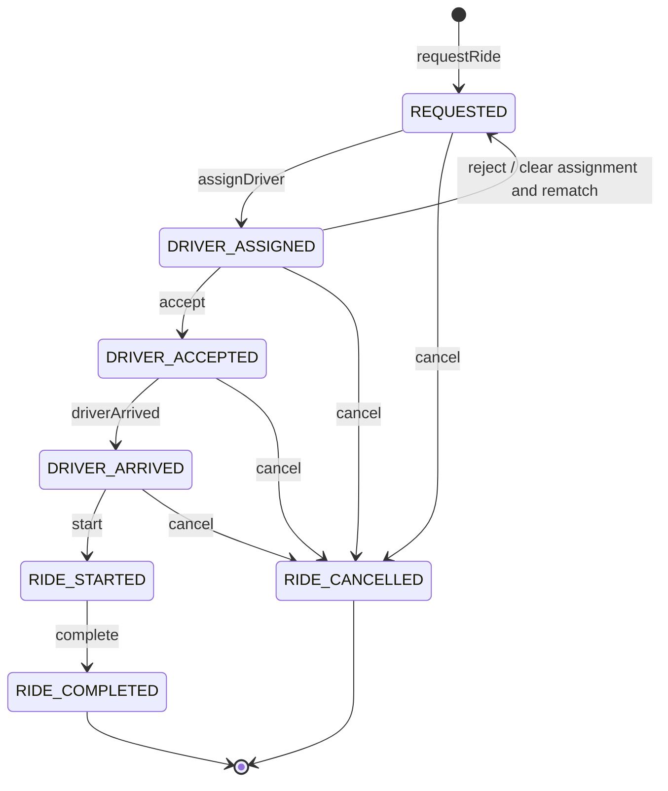

# Ride Sharing Application

## Problem Statement

Design and implement a **ride-sharing application** similar to Uber/Ola that allows passengers to book rides with available drivers.

The system should be designed with **extensibility and loose coupling** in mind. New vehicle types, fare calculation strategies, and notification mechanisms should be easy to introduce without modifying existing core business logic.

## Functional Requirements

### 1. User Management

The system should support two types of users:

* Passenger
* Driver

Each user should have:

* User ID
* Name
* Phone number
* Current location

### 2. Vehicle Management

The system should support multiple vehicle types.

Initially, the following vehicle types must be supported:

* Car
* Bike

The design should allow new vehicle types to be added in the future without requiring significant changes to the existing system.

Examples of future vehicle types could include:

* SUV
* Auto
* Electric Car

A driver should be associated with a vehicle.

### 3. Driver Management

Drivers can:

* Register their vehicle.
* Update their current location.
* Change their availability status.

Possible driver statuses:

```text
ONLINE
BUSY
OFFLINE
```

Only `ONLINE` drivers should be considered for ride matching.

### 4. Ride Request

A passenger can request a ride by providing:

* Pickup location
* Destination
* Vehicle type

The system should create a ride request and find a suitable driver.

### 5. Ride Matching

The system must assign the **nearest available driver** to the passenger.

The matching algorithm should:

1. Find all available drivers.
2. Filter drivers based on the requested vehicle type.
3. Calculate the distance between the passenger's pickup location and each driver's current location.
4. Select the driver with the minimum distance.
5. Assign the driver to the ride.

For example:

```text
Passenger
   |
   |---- 2.5 km ---- Driver A
   |
   |---- 1.2 km ---- Driver B  ← Selected
   |
   |---- 3.7 km ---- Driver C
```

Driver B should be assigned because they are the closest suitable driver.

If the assigned driver rejects the ride, the system should attempt to assign the next nearest available driver.

The driver matching mechanism should be designed so that additional matching strategies can be introduced in the future.

### 6. Ride Lifecycle

#### Transition Graph



`RIDE_COMPLETED` and `RIDE_CANCELLED` are terminal states. Every transition not
shown here is invalid and must raise an `IllegalStateException`.

A ride should progress through the following statuses:

```text
REQUESTED
    ↓
DRIVER_ASSIGNED
    ↓
DRIVER_ACCEPTED
    ↓
DRIVER_ARRIVED
    ↓
RIDE_STARTED
    ↓
RIDE_COMPLETED
```

A ride can also be cancelled before completion.

The system should ensure that invalid state transitions are not allowed.

### 7. Fare Calculation

The system must support **multiple fare calculation strategies**.

At minimum, the following three strategies must be implemented:

1. **Standard Fare**
2. **Shared Fare**
3. **Luxury Fare**

The fare calculation mechanism should be designed so that additional pricing strategies can be added in the future without modifying the existing ride-management logic.

The fare may depend on factors such as:

* Distance
* Ride duration
* Vehicle type
* Pricing strategy

For example:

```text
FareCalculationStrategy
        |
        +---- StandardFareStrategy
        |
        +---- SharedFareStrategy
        |
        +---- LuxuryFareStrategy
```

The exact pricing formulas are part of the implementation/design exercise.

### 8. Payment

A passenger should be able to pay for a completed ride.

The system should support multiple payment methods, such as:

* Cash
* Credit/Debit Card
* UPI

The payment mechanism should be extensible so that new payment methods can be added in the future.

### 9. Notifications

The system must send notifications to **both the passenger and the driver** as the ride progresses through its different statuses.

For example:

```text
REQUESTED
    ↓
Passenger: "Ride requested"

DRIVER_ASSIGNED
    ↓
Passenger: "Driver has been assigned"
Driver:    "You have been assigned a ride"

DRIVER_ACCEPTED
    ↓
Passenger: "Driver accepted your ride"

DRIVER_ARRIVED
    ↓
Passenger: "Your driver has arrived"

RIDE_STARTED
    ↓
Passenger: "Your ride has started"
Driver:    "Ride started"

RIDE_COMPLETED
    ↓
Passenger: "Your ride has been completed"
Driver:    "Ride completed"
```

The notification mechanism should be decoupled from the ride-management logic.

The design should allow different notification mechanisms to be supported in the future, such as:

* SMS
* Push Notification
* Email

### 10. Ride History

Passengers should be able to view their previous rides.

Drivers should be able to view rides they have completed.

Each ride should contain information such as:

* Passenger
* Driver
* Vehicle
* Pickup location
* Destination
* Fare
* Ride status
* Ride timestamps

### 11. Ratings

After a ride is completed:

* The passenger can rate the driver.
* The driver can rate the passenger.
* Ratings should be between 1 and 5.

## Non-Functional Requirements

The design should:

* Follow **SOLID principles**.
* Minimize coupling between components.
* Favor composition over inheritance where appropriate.
* Support extension without modifying existing core business logic.
* Be easily extensible for new vehicle types.
* Be easily extensible for new fare calculation strategies.
* Be easily extensible for new payment methods.
* Be easily extensible for new notification mechanisms.
* Be easily extensible for new driver-matching algorithms.
* Be testable using unit tests.
* Support multiple ride requests.

## Assumptions

For the initial implementation:

* Real-time GPS tracking is out of scope.
* A location can be represented using latitude/longitude or a simplified coordinate system.
* Euclidean distance can be used for calculating the distance between two locations.
* Actual payment gateway integration is out of scope.
* Database/persistence is out of scope.
* Authentication and authorization are out of scope.
* The default driver matching strategy is **nearest available driver**.
* Concurrency should be considered when assigning drivers to rides.

## Expected Core Concepts

The system will likely require concepts such as:

```text
User
├── Passenger
└── Driver

Vehicle
├── Car
└── Bike

Ride
Location
Fare
Payment
Notification
Rating
```

Potential abstractions include:

```text
DriverMatchingStrategy
FareCalculationStrategy
PaymentStrategy
NotificationService
DistanceCalculator
```

> **Note:** The above entities and abstractions are not intended to be the solution. They are starting points for the design exercise. Derive the appropriate classes, interfaces, relationships, and design patterns from the requirements before implementing the solution.
